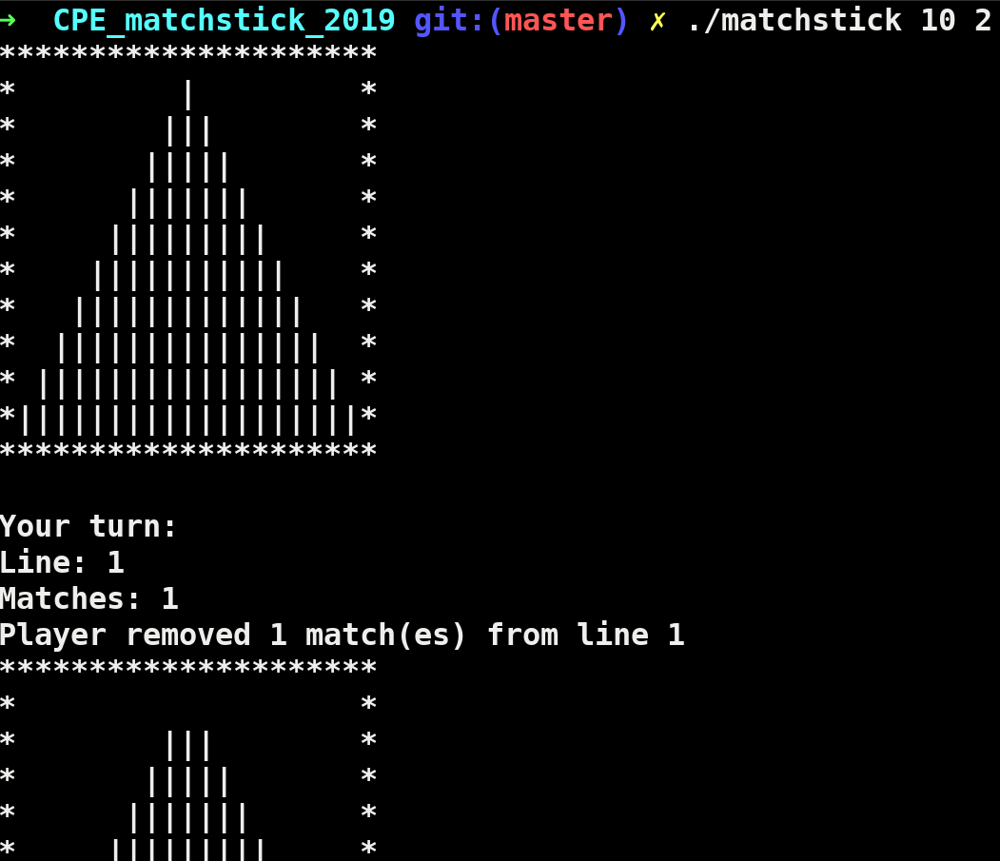

# CPE_matchstick_2019

Jeu des allumettes:

./matchstick [arg1] [arg2]

Argument 1 -> nombre de lignes
Argument 2 -> nombre maximum d'allumettes à retirer par tour

L'utilisateur joue contre une IA. Le perdant est celui qui retire la dernière allumette.

